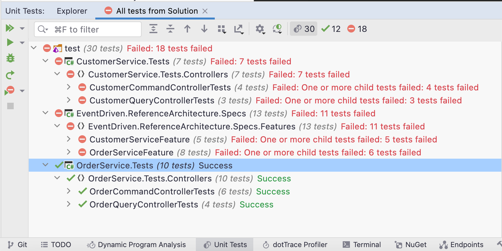

# Exercise: Domain Driven Design

DDD Exercise

## Prerequisites
- [.NET Core SDK](https://dotnet.microsoft.com/download) (6.0 or greater)
- [Docker Desktop](https://www.docker.com/products/docker-desktop)
- MongoDB Docker: `docker run --name mongo -d -p 27017:27017 -v /tmp/mongo/data:/data/db mongo`
- [MongoDB Client](https://robomongo.org/download):
  - Download Robo 3T only.
  - Add connection to localhost on port 27017.
- [Microsoft Tye](https://github.com/dotnet/tye/blob/main/docs/getting_started.md)
- [Specflow](https://specflow.org/) IDE Plugin for either:
  - [Visual Studio](https://docs.specflow.org/projects/getting-started/en/latest/GettingStarted/Step1.html)
  - [JetBrains Rider](https://docs.specflow.org/projects/specflow/en/latest/Rider/rider-installation.html)

> **Note**: Run `docker ps -a` to see if there is a `mongo` container with volumes mapped to the host. If so, run `docker rm -f mongo` to remove it. Then run the **MongoDB Docker** command above to re-create the `mongo` container.

## Steps

> **Note**: This exercise uses a **BDD / TDD** development approach, in which the specification is first defined using SpecFlow acceptance tests via feature files using Gherkin syntax. Enough of the source code is written so that the acceptance and unit tests compile but fail when they are run.
> 
> First code is written in order to make the **unit tests** pass, but the acceptance tests will still fail because the repository classes have not yet been written. Once the repositories are written, the SpecFlow **acceptance tests** will pass.

1. Build the **before** solution.
   - Open **ddd-before.sln** in Rider (or an IDE of your choice).
   - Build the solution.
     - Ignore build warnings for now.
2. Using the **Test Explorer** in Rider, run user acceptance tests with **Tye** and **SpecFlow**.
   >**Note**: While it is possible to run each service directly from the IDE, Tye sets **environment variables** which point to test databases that are populated by the `Hooks` class. You can then set breakpoints and debug source code by attaching to service processes. 
   - Open a terminal at the **test/EventDriven.ReferenceArchitecture.Specs** directory.
    ```bash
    cd test/EventDriven.ReferenceArchitecture.Specs
    tye run
    ```
   - Open http://localhost:8000/
     - Make sure both CustomerService and OrderService are running.

   - Open the test explorer and run the **EventDriven.ReferenceArchitecture.Specs** acceptance test.
     - *All the tests should fail.*
3. Run the **CustomerService.Tests** unit tests.
   - *All the test should fail.*
4. Run the **OrderService.Tests** unit tests.
   - *All the test should pass.*

    - Stop Tye with Ctrl+C.
5. Add `ICustomerRepository.cs` to **CustomerService/Repositories**.
    ```csharp
    using CustomerService.Domain.CustomerAggregate;

    namespace CustomerService.Repositories;

    public interface ICustomerRepository
    {
        Task<IEnumerable<Customer>> GetAsync();
        Task<Customer?> GetAsync(Guid id);
        Task<Customer?> AddAsync(Customer entity);
        Task<Customer?> UpdateAsync(Customer entity);
        Task<int> RemoveAsync(Guid id);
    }
    ```
6. Add a ctor to `CustomerCommandController`.
   - Add parameters for `ICustomerRepository` and `IMapper`.
7. Update `CustomerCommandControllerTests` in **CustomerService.Tests**.
   - Add fields for `Mock<ICustomerRepository>` and `IMapper` and initialize them in a ctor.
    ```csharp
    private readonly Mock<ICustomerRepository> _repositoryMoq;
    private readonly IMapper _mapper;

    public CustomerCommandControllerTests()
    {
        _repositoryMoq = new Mock<ICustomerRepository>();
        _mapper = MappingHelper.GetMapper();
    }
    ```
8. Flesh out the first unit test.
    ```csharp
    [Fact]
    public void WhenInstantiated_ThenShouldBeOfCorrectType()
    {
        var controller = new CustomerCommandController(_repositoryMoq.Object, _mapper);

        Assert.IsAssignableFrom<ControllerBase>(controller);
        Assert.IsType<CustomerCommandController>(controller);
    }
    ```
9. Flesh out the next unit test.
   - Create a new `CustomerCommandController`, passing in `_repositoryMoq` and `_mapper`.
   - Use `_mapper` to map a `Customer` DTO from a `Customer` entity.
   - Call `_repositoryMoq.Setup` to set up the method that is called by the controller.
   - Call the controller method being tested and cast the result.
   - Assert the correct result was returned.
    ```csharp
    [Fact]
    public async Task GivenWeAreCreatingACustomer_WhenSuccessful_ThenShouldProvideNewEntityWithPath()
    {
        var customerOut = _mapper.Map<Customer>(Customers.Customer1);

        _repositoryMoq.Setup(x => x.AddAsync(It.IsAny<Customer>()))
            .ReturnsAsync(customerOut);

        var controller = new CustomerCommandController(_repositoryMoq.Object, _mapper);

        var actionResult = await controller.Create(Customers.Customer1);
        var createdResult = actionResult as CreatedResult;

        Assert.NotNull(actionResult);
        Assert.NotNull(createdResult);
        Assert.Equal($"api/customer/{customerOut.Id}", createdResult!.Location, true);
    }
    ```
10. Flesh out the remaining unit tests.
    ```csharp
    [Fact]
    public async Task GivenWeAreUpdatingACustomer_WhenSuccessful_ThenUpdatedEntityShouldBeReturned()
    {
        var customerIn = Customers.Customer2;
        var customerOut = _mapper.Map<Customer>(Customers.Customer2);

        var controller = new CustomerCommandController(_repositoryMoq.Object, _mapper);

        _repositoryMoq.Setup(x => x.UpdateAsync(It.IsAny<Customer>()))
            .ReturnsAsync(customerOut);

        var actionResult = await controller.Update(customerIn);
        var objectResult = actionResult as OkObjectResult;

        Assert.NotNull(actionResult);
        Assert.NotNull(objectResult);
        Assert.Equal(customerIn.Id, ((DTO.Write.Customer)objectResult!.Value!).Id);
    }
    ```
    ```csharp
    [Fact]
    public async Task GivenWeAreRemovingACustomer_WhenSuccessful_ThenShouldReturnSuccess()
    {
        var customerId = Guid.NewGuid();
        var controller = new CustomerCommandController(_repositoryMoq.Object, _mapper);

        _repositoryMoq.Setup(x => x.RemoveAsync(It.IsAny<Guid>()))
            .ReturnsAsync(1);

        var actionResult = await controller.Remove(customerId);
        var noContentResult = actionResult as NoContentResult;

        Assert.NotNull(actionResult);
        Assert.NotNull(noContentResult);
    }
    ```
11. Add a ctor to `CustomerQueryController`.
    - Add parameters for `ICustomerRepository` and `IMapper`.
12. Flesh out unit tests in **CustomerQueryControllerTests**.
    ```csharp
    public class CustomerQueryControllerTests
    {
        private readonly Mock<ICustomerRepository> _repositoryMoq;
        private readonly IMapper _mapper;

        public CustomerQueryControllerTests()
        {
            _repositoryMoq = new Mock<ICustomerRepository>();
            _mapper = MappingHelper.GetMapper();
        }

        [Fact]
        public void WhenInstantiated_ThenShouldBeOfCorrectType()
        {
            var controller = new CustomerQueryController(_repositoryMoq.Object, _mapper);

            Assert.IsAssignableFrom<ControllerBase>(controller);
            Assert.IsType<CustomerQueryController>(controller);
        }

        [Fact]
        public async Task WhenRetrievingAllCustomers_ThenAllCustomersShouldBeReturned()
        {
            _repositoryMoq.Setup(x => x.GetAsync())
                .ReturnsAsync(new List<Customer>
                {
                    _mapper.Map<Customer>(Customers.Customer1),
                    _mapper.Map<Customer>(Customers.Customer2),
                    _mapper.Map<Customer>(Customers.Customer3)
                });

            var controller = new CustomerQueryController(_repositoryMoq.Object, _mapper);

            var actionResult = await controller.GetCustomers();
            var okResult = Assert.IsType<OkObjectResult>(actionResult);
            var value = (IEnumerable<CustomerView>)okResult.Value!;

            Assert.Collection(value,
                c => Assert.Equal(CustomerViews.Customer1.Id, c.Id),
                c => Assert.Equal(CustomerViews.Customer2.Id, c.Id),
                c => Assert.Equal(CustomerViews.Customer3.Id, c.Id));
        }

        [Fact]
        public async Task GivenWeAreRetrievingACustomerById_WhenSuccessful_ThenCorrectCustomerShouldBeReturned()
        {
            _repositoryMoq.Setup(x => x.GetAsync(It.IsAny<Guid>()))
                .ReturnsAsync(_mapper.Map<Customer>(Customers.Customer1));

            var controller = new CustomerQueryController(_repositoryMoq.Object, _mapper);

            var actionResult = await controller.GetCustomer(Customers.Customer1.Id);
            var okResult = Assert.IsType<OkObjectResult>(actionResult);
            var value = (CustomerView)okResult.Value!;

            Assert.Equal(CustomerViews.Customer1.Id, value.Id);
        }
    }
    ```
13. Run the unit tests for **CustomerService.Tests**.
    - The *tests should fail* with `NotImplementedException`.
14. Flesh out `CustomerCommandController` in **CustomerService**.
    - Add a ctor that accepts `ICustomerRepository` and `IMapper`.
    ```csharp
    private readonly ICustomerRepository _repository;
    private readonly IMapper _mapper;

    public CustomerCommandController(
        ICustomerRepository repository,
        IMapper mapper)
    {
        _repository = repository;
        _mapper = mapper;
    }
    ```
    - For the `Create` action perform the following.
      - Map incoming DTO's to entities.
      - Use the repository.
      - Map the outgoing entities to DTO's.
      - Return an action result.
    ```csharp
    // POST api/customer
    [HttpPost]
    public async Task<IActionResult> Create([FromBody] DTO.Write.Customer customerDto)
    {
        var customerIn = _mapper.Map<Customer>(customerDto);
        var result = await _repository.AddAsync(customerIn);

        var customerOut = _mapper.Map<DTO.Write.Customer>(result);
        return Created($"api/customer/{customerOut.Id}", customerOut);
    }
    ```
    - Flesh out the `Update` action.
    ```csharp
    // PUT api/customer
    [HttpPut]
    public async Task<IActionResult> Update([FromBody] DTO.Write.Customer customerDto)
    {
        var customerIn = _mapper.Map<Customer>(customerDto);
        var result = await _repository.UpdateAsync(customerIn);

        var customerOut = _mapper.Map<DTO.Write.Customer>(result);
        return Ok(customerOut);
    }
    ```
    - Flesh out the `Remove` action.
    ```csharp
    // DELETE api/customer/id
    [HttpDelete]
    [Route("{id}")]
    public async Task<IActionResult> Remove([FromRoute] Guid id)
    {
        await _repository.RemoveAsync(id);
        return NoContent();
    }
    ```
15. Flesh out `CustomerQueryController` in **CustomerService**.
    ```csharp
    public class CustomerQueryController : ControllerBase
    {
        private readonly ICustomerRepository _repository;
        private readonly IMapper _mapper;

        public CustomerQueryController(
            ICustomerRepository repository,
            IMapper mapper)
        {
            _repository = repository;
            _mapper = mapper;
        }

        // GET api/customer
        [HttpGet]
        public async Task<IActionResult> GetCustomers()
        {
            var customers = await _repository.GetAsync();
            var result = _mapper.Map<IEnumerable<CustomerView>>(customers);
            return Ok(result);
        }

        // GET api/customer/id
        [HttpGet]
        [Route("{id:guid}")]
        public async Task<IActionResult> GetCustomer([FromRoute] Guid id)
        {
            var customer = await _repository.GetAsync(id);
            if (customer == null) return NotFound();
            var result = _mapper.Map<CustomerView>(customer);
            return Ok(result);
        }
    }
    ```
16. Run the unit tests for **CustomerService.Tests**.
    - The tests should now pass.
17. Add a `CustomerRepository` class to **CustomerService**.
    - Add a `[ExcludeFromCodeCoverage]` attribute to the class.
    > **Note**: Repositories are best covered by **integration tests**, *not unit tests*, because the underlying provider cannot be adequately mocked.
    - Extend `DocumentRepository<Customer>` and implement `ICustomerRepository`.
    ```csharp
    [ExcludeFromCodeCoverage]
    public class CustomerRepository : DocumentRepository<Customer>, ICustomerRepository
    {
        public CustomerRepository(IMongoCollection<Customer> collection) : base(collection)
        {
        }
    ```
    - Call the base class methods.
    ```csharp
    public async Task<IEnumerable<Customer>> GetAsync() =>
        await FindManyAsync();

    public async Task<Customer?> GetAsync(Guid id) =>
        await FindOneAsync(e => e.Id == id);

    public async Task<int> RemoveAsync(Guid id) =>
        await DeleteOneAsync(e => e.Id == id);
    ```
    - For `AddAsync` and `UpdateAsync` set the entity `ETag`.
    - For `UpdateAsync` throw a `ConcurrencyException` if the incoming `ETag` does not match the existing one.
    ```csharp
    public async Task<Customer?> AddAsync(Customer entity)
    {
        var existing = await FindOneAsync(e => e.Id == entity.Id);
        if (existing != null) return null;
        if (string.IsNullOrWhiteSpace(entity.ETag))
            entity.ETag = Guid.NewGuid().ToString();
        return await InsertOneAsync(entity);
    }

    public async Task<Customer?> UpdateAsync(Customer entity)
    {
        var existing = await GetAsync(entity.Id);
        if (existing == null) return null;
        if (string.Compare(entity.ETag, existing.ETag, StringComparison.OrdinalIgnoreCase) != 0 )
            throw new ConcurrencyException();
        entity.ETag = Guid.NewGuid().ToString();
        return await FindOneAndReplaceAsync(e => e.Id == entity.Id, entity);
    }
    ```
18. Update code in **EventDriven.ReferenceArchitecture.Specs** so that the acceptance tests pass.
    - Look up each `TODO` item and uncomment code.
      - These should be in the `Hooks` and `StepDefinitions` classes.

    - Execute `tye run` from the terminal.
    - Run the acceptance tests. *The CustomerServiceFeature acceptance tests will fail.*
    - Stop Tye with Ctrl+C.
19. Run **CustomerService** directly from the IDE.
    - Use Swagger to execute the GET action.
    - You should get a *dependency injection error*.
    - Resolve the error by updating `Program` to add database settings.
      - Be sure to resolve the namespace for `Customer` to `DomainAggregate.Customer` entity, not the `Customer` DTO. 
    ```csharp
    // Add database settings
    builder.Services.AddSingleton<ICustomerRepository, CustomerRepository>();
    builder.Services.AddMongoDbSettings<CustomerDatabaseSettings, Customer>(builder.Configuration);
    ```
    - The `AddMongoDbSettings` method maps a class that implements `IMongoDbSettings` to a section in appsettings.json with a name that matches the class name.
      - For example, the `CustomerDatabaseSettings` class has properties which match the `CustomerDatabaseSettings` section in appsettings.json.
    - Rerun **CustomerService**. *The error should go away.*
    - Execute `tye run` from the terminal.
    - Run the acceptance tests. *The CustomerServiceFeature acceptance tests will pass.*
    - Stop Tye with Ctrl+C.
